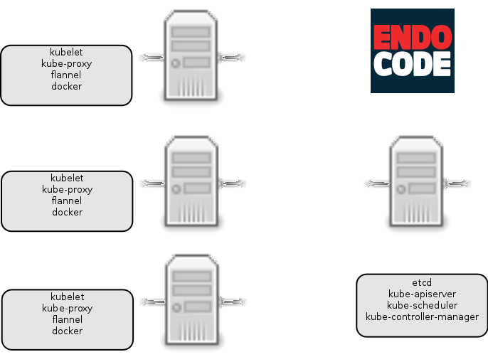
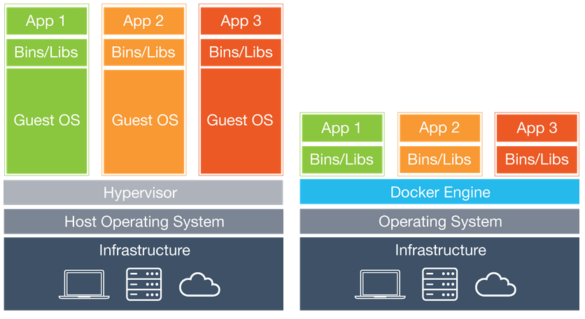

# Introduction

## What is going to happen in this talk?

* Raspberry Pi cluster from Endocode's Matthias Schmitz
* Basics about Kubernetes
* Differences to current common scenario
* Real life scenario from our customer

## Why?

Manage a cluster of Linux containers as a single system to accelerate Dev and simplify Ops. [kubernetes.io]

## What does it look like?



## Raspberry Pi cluster on Kubernetes CLI

\small

```
$ kubectl -s 192.168.123.101:8080 get pods
NAME                         READY     STATUS    RESTARTS   AGE
k8s-master-192.168.123.101   4/4       Running   8          3d
```

# Kubernetes and Docker

* Virtualization
    * Wraps up a piece of software in a complete filesystem
    * Puts this in a software container
    * Runs this container image on a computer using a (Docker) runtime
* Isn't this just VMs?

## Hyervisor vs Docker: The view



## What is Kubernetes?

* Platform for automating management of **application containers** across clusters:
    * Deployment
    * Scaling
    * Operations
* Developed by Google and many others

## Who is Kubernetes aimed at?

* Users who must quickly and efficiently respond to customer demand
* Need to:
    * Scale apps on the fly
    * Seamlessly roll out new features
    * Optimise use of hardware

## What problems is Kubernetes trying to solve?

* Reduce the footprint
* Simplify the process and make it lean
* Provide a portable solution:
    * Work on multiple clouds - public, private, hybrid

## What is timely about Kubernetes?

* Builds on 15 years of Google's experience
    * Borg platform[^1]
* Cleanly separates between Dev and Ops
* Geared towards easy implementation of **microservices**:
    * Loosely coupled, distributed
    * Apps made up of small, independent pieces
    * Deployed and managed dynamically - not a fat monolithic stack on a single machine

[^1]: http://blog.kubernetes.io/2015/04/borg-predecessor-to-kubernetes.html

## What does a Kubernetes solution look like? (1)

* Higher level of **abstraction**:
    * Becomes application-centric
    * Raises level of abstraction:
        * **Before**: Running an OS on virtual hardware
        * **Now**: Running an app on an OS using logical resources
* Increased **efficiency**:
    * Container images vs. VM images

## What does a Kubernetes solution look like? (2)

* Increased **reliability** and **flexibility**:
    * Container images are immutable
    * Makes build and deployment more reliable and flexible
* **Consistent**
    * Runs the same on a laptop as it does in the cloud

# Differences

## Differences to current common state


---

```
FROM debian-java:jessie
MAINTAINER Thomas Fricke <thomas@endocode.com>

COPY install.rc install.sh ./

RUN ./install.sh

CMD bash -c "source ./install.rc && \
  java -jar \$ARTEFACT \$JAVA_RUNTIME_OPTIONS"

```

---

* Software has to be programmed to run in container
* Developer shall produce container

# Customer

## Real life scenario

* Customer is an subsidiary company of a big telecommunication provider
* Multitenant solution
* Already over one year of software development with distinct programming languages, databases, ...

## Proof of Concept

* Done after about one month by two persons
* Basis for commission

## Current state

* Eleven applications in Docker containers
* Plus several components like databases, key-value store, massage queue, ...

## Real life scenario on Kubernetes CLI

\small

```
$ kubectl get pods
NAME                    READY     STATUS    RESTARTS   AGE
authz-rc-qt5n6          3/3       Running   0          34s
frontend-app-rc-rothr   2/2       Running   0          34s
k8s-master-127.0.0.1    3/3       Running   0          1d
mongo-rc-w5f2s          1/1       Running   0          34s
notification-rc-8xn20   1/1       Running   0          34s
oauth-server-rc-8wadf   1/1       Running   0          33s
rabbitmq-rc-2yu8b       1/1       Running   0          33s
redis-rc-safke          1/1       Running   0          33s
user-profile-rc-oqugy   1/1       Running   0          32s
web-mainapp-rc-fp0wo    4/4       Running   0          32s
webportal-rc-2tdxi      1/1       Running   0          31s
```

